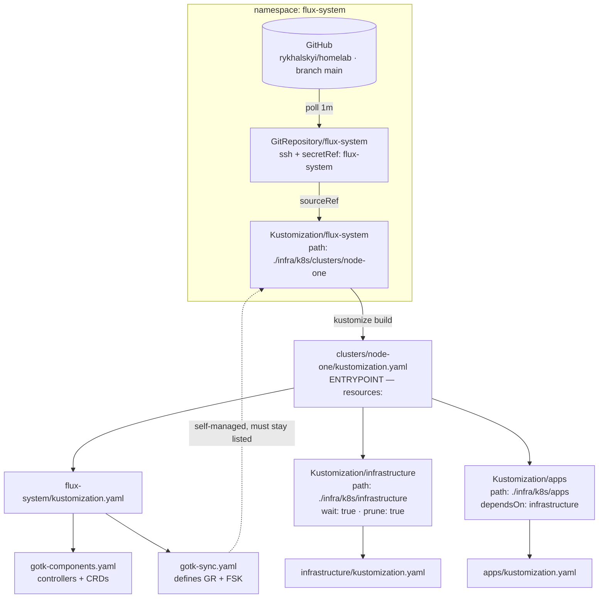
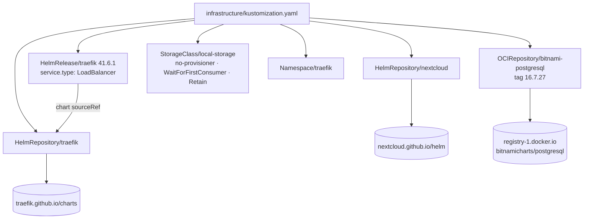
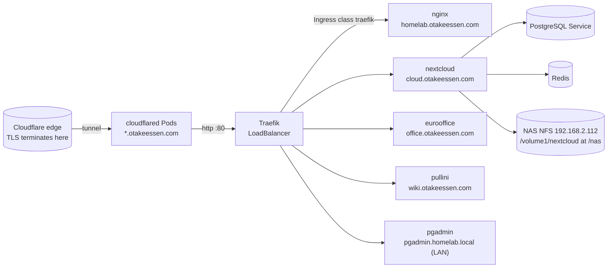

# k3s config graph: entrypoint, Kustomizations, and leaves

A map of every YAML manifest under `infra/k8s/`, the **entrypoint** Flux
reconciles from, and how the configs reference each other down to the
**leaves** (external charts, images, Secrets, storage, the tunnel edge).

> **Scope.** Config/ownership edges only — Flux `sourceRef`, kustomize
> `resources:`, Helm `sourceRef`/`chartRef`, `existingSecret`, `claimName`,
> Ingress→Service. Traffic flow at runtime is the last diagram.

## 1. Reconcile chain (entrypoint → roots → workloads)



`flux-system/kustomization.yaml` is intentionally re-listed by the root: if
omitted, a `prune: true` reconcile deletes Flux's own controllers (this caused
the 2026-10-02 self-prune incident — see [[Backups: what to save and how to restore]]).

## 2. Infrastructure root (add-ons + chart sources)



## 3. Apps root (workloads + Secret/storage leaves)

```mermaid
flowchart TD
  APPS["apps/kustomization.yaml"]

  APPS --> NS_APP["Namespace/homelab"]
  APPS --> NGINX
  APPS --> NC
  APPS --> PG
  APPS --> PGA
  APPS --> EO
  APPS --> PL
  APPS --> CFD

  subgraph NGINX["apps/nginx/"]
    NG_D["Deployment/nginx"] --> NG_S["Service/nginx :80"]
    NG_S --> NG_I["Ingress/nginx<br/>class traefik · homelab.otakeessen.com"]
  end

  subgraph NC["apps/nextcloud/"]
    NC_ST["storage.yaml<br/>PV nextcloud-data + PVC nextcloud-data<br/>PVC nextcloud-html"]
    NC_HR["HelmRelease/nextcloud 9.3.0<br/>dependsOn: postgresql<br/>host cloud.otakeessen.com"]
  end

  subgraph PG["apps/postgresql/"]
    PG_HR["HelmRelease/postgresql<br/>chartRef: OCIRepository/bitnami-postgresql"]
  end

  subgraph PGA["apps/pgadmin/"]
    PGA_PVC["PVC/pgadmin-data"] --> PGA_D["Deployment/pgadmin"]
    PGA_D --> PGA_S["Service/pgadmin :80"]
    PGA_S --> PGA_I["Ingress/pgadmin<br/>class traefik · pgadmin.homelab.local"]
  end

  subgraph EO["apps/eurooffice/"]
    EO_PVC["PVC/eurooffice-data"] --> EO_D["Deployment/eurooffice"]
    EO_D --> EO_S["Service/eurooffice :80"]
    EO_MW["Middleware x2<br/>forwarded-proto, hide-welcome"] --> EO_I["Ingress/eurooffice<br/>class traefik · office.otakeessen.com"]
    EO_S --> EO_I
  end

  subgraph PL["apps/pullini/"]
    PL_PVC["PVC/pullini-data"] --> PL_D["Deployment/pullini<br/>web + scheduler"]
    PL_CM["ConfigMap/pullini-config"] --> PL_D
    PL_D --> PL_S["Service/pullini :80"]
    PL_MW["Middleware<br/>forwarded-proto"] --> PL_I["Ingress/pullini<br/>class traefik · wiki.otakeessen.com"]
    PL_S --> PL_I
  end

  subgraph CFD["apps/cloudflared/"]
    CFD_CM["ConfigMap/cloudflared-config<br/>ingress → traefik.traefik.svc:80"] --> CFD_D["Deployment/cloudflared x2"]
  end

  %% Nextcloud wiring
  NC_HR -->|existingClaim| NC_ST
  NC_HR -->|existingSecret nextcloud-admin| SEC_ADMIN
  NC_HR -->|existingSecret nextcloud-db| SEC_DB
  NC_HR -->|existingSecret nextcloud-redis| SEC_REDIS
  NC_HR -->|secretKeyRef byebyemoneylist| SEC_BYML
  NC_HR -->|chart sourceRef| SRC_NC2[("HelmRepository/nextcloud")]

  %% Postgres wiring
  PG_HR -->|existingSecret nextcloud-db| SEC_DB
  NC_HR -. "externalDatabase.host: postgresql" .-> PG_HR

  %% other Secret refs
  PGA_D -->|secretKeyRef pgadmin-auth| SEC_PGA
  EO_D -->|secretKeyRef eurooffice-jwt| SEC_EO
  PL_D -->|envFrom pullini-secrets| SEC_PL
  CFD_D -->|secretKeyRef cloudflared-tunnel| SEC_TUN
  CFD_D -->|volume cloudflared-credentials| SEC_CRED

  %% storage class leaves
  NC_ST --> SC2["StorageClass/local-storage"]
  PGA_PVC --> SC3["StorageClass/local-path (k3s)"]
  EO_PVC --> SC3
  PL_PVC --> SC3
  PG_HR -->|primary.persistence| SC3

  subgraph SECRETS["out-of-band Secrets (namespace homelab, gitignored)"]
    SEC_ADMIN["nextcloud-admin"]
    SEC_DB["nextcloud-db"]
    SEC_REDIS["nextcloud-redis"]
    SEC_BYML["byebyemoneylist"]
    SEC_PGA["pgadmin-auth"]
    SEC_EO["eurooffice-jwt"]
    SEC_PL["pullini-secrets"]
    SEC_TUN["cloudflared-tunnel"]
    SEC_CRED["cloudflared-credentials"]
  end
```



## 4. Runtime edge (Cloudflare → Traefik → Services)



## Edges at a glance

| From | Relationship | To | File |
| --- | --- | --- | --- |
| `flux-system` Kustomization | `path` | `clusters/node-one/` | `gotk-sync.yaml` |
| root kustomization | `resources` | `apps.yaml`, `infrastructure.yaml`, `flux-system` | `clusters/node-one/kustomization.yaml` |
| `apps` Kustomization | `dependsOn` | `infrastructure` | `clusters/node-one/apps.yaml` |
| `infrastructure` Kustomization | `wait: true` | infra add-ons | `clusters/node-one/infrastructure.yaml` |
| `HelmRelease/traefik` | `sourceRef` | `HelmRepository/traefik` | `infrastructure/traefik/helmrelease.yaml` |
| `HelmRelease/nextcloud` | chart `sourceRef` | `HelmRepository/nextcloud` | `apps/nextcloud/helmrelease.yaml` |
| `HelmRelease/postgresql` | `chartRef` | `OCIRepository/bitnami-postgresql` | `apps/postgresql/helmrelease.yaml` |
| `HelmRelease/nextcloud` | `dependsOn` | `HelmRelease/postgresql` | `apps/nextcloud/helmrelease.yaml` |
| Nextcloud / Postgres | `existingSecret` | `nextcloud-admin`, `nextcloud-db`, `nextcloud-redis`, `byebyemoneylist` | both HelmReleases |
| workload Deployments | `secretKeyRef` / `envFrom` | `pgadmin-auth`, `eurooffice-jwt`, `pullini-secrets` | `apps/*/deployment.yaml` |
| cloudflared | `secretKeyRef` + volume | `cloudflared-tunnel`, `cloudflared-credentials` | `apps/cloudflared/deployment.yaml` |
| Ingresses | `ingressClassName` | `traefik` | `apps/*/ingress.yaml` |
| PVC / PV | `storageClassName` | `local-storage` (static) or `local-path` (dynamic) | `apps/*/pvc.yaml`, `nextcloud/storage.yaml` |

## Gotchas captured here

- **`apps/secrets/` is not in `apps/kustomization.yaml`.** The `*.sops.yaml`
  files are gitignored (`.gitignore`: `/infra/k8s/apps/secrets/`) and applied
  out of band with `bash infra/k8s/apps/secrets/apply.sh` (SOPS + age). Flux
  never sees them, so the Secret boxes above are **leaves** — required *before*
  a rollout, but not reconciled.
- **`flux-system` must stay in the root `resources:` list** or Flux prunes its
  own controllers.
- **Two storage classes:** `local-storage` is defined in
  `infrastructure/storageclass/`; `local-path` is k3s's built-in.
- **`OCIRepository`, not `HelmRepository`,** for Bitnami Postgres — the legacy
  chart index now points at an OCI URL Flux cannot fetch.
- Pin every image by digest and every chart to an exact version; the
  `update-*-pin.yml` workflows own those edits.

## Verify

```bash
flux get kustomizations
kubectl -n homelab get deploy,sts,po,ingress,pvc
flux reconcile kustomization apps --with-source
```

## Related

- [[k3s + GitOps: nginx and cloudflared (phase 2.1)]]
- [[Nextcloud on k3s (custom image + Helm chart)]]
- [[PostgreSQL + pgAdmin on k3s (decoupled from Nextcloud)]]
- [[Pullini on k3s (postgresql + Flux)]]
- [[Backups: what to save and how to restore]]
